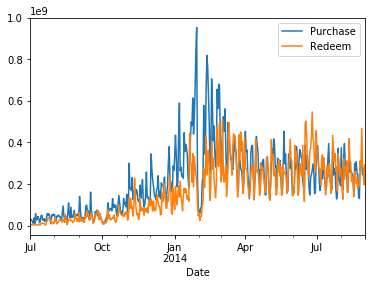
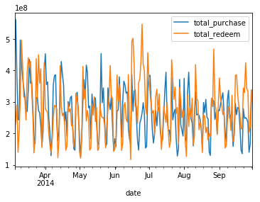

## 赛题回顾
[本赛题](https://tianchi.aliyun.com/getStart/introduction.htm?spm=5176.11165418.333.9.44c549ecQaf3W0&raceId=231573)提供了20130701到20140831这427天的用户申购赎回详细记录，用户基本信息记录，支付宝收益率记录和shibor利率记录，要求预测2014年9月这30天，每一天的总申购值和总赎回值。评价指标采用每天的相对误差计算一个得分，得分的具体公式没有公布，总之每天的预测值越接近真实值，评分越高。
## 数据探索
本题是典型的时间序列预测，通过前面427天每一天的总申购和总赎回值去预测9月份30天每一天的总申购和总赎回值。因此，先通过user_balance_table.csv汇总每一天总申购和总赎回值，画出图像：

可以看出这427天的时间序列数据并不是stationary的，从2013年7月到2014年1月到2月，申购值和赎回值都呈增长的趋势。虽然从整体上看，数据有一定的时间规律(波峰到波谷再到波峰)，但是噪声很大，有很多异常值。要想从这427天的数据准确的预测9月份30天的申购和赎回值感觉挺困难的。
## 思路
正好最近在学习Tensorflow，而时间序列预测又想到了rnn。因此决定用循环神经网络来做，参考了[seq2seq-signal-prediction ](https://github.com/guillaume-chevalier/seq2seq-signal-prediction)，感觉seq2seq模型很适合做本题的预测。Tensorflow中basic_rnn_seq2seq的结构如图所示：

由于seq2seq模型常用来做机器翻译，因此图中的输入和输出都是字母。我们这里的输入和输出都是实数。模型由encoder和decoder两个rnn组成，encoder的输入为前面30天每一天的申购和赎回值以及其他一些特征，在最后一个节点把这些特征转换成一个hidden state传递给decoder。decoder的节点输出可以有多种选择(与encoder的输入相同，或者在训练的时候用前一天的期望值作为本次的输入，在预测中使用前一个节点的输出作为本次的输入)，输出则是后30天的申购和赎回值。训练数据采用后420天的数据，划分为13组，每一次迭代都用全部的数据。本题数据量太少了，训练一个不过拟合的seq2seq模型有点困难。我想这样是为什么很多参数选手都使用ARMIA这样的传统方法。
## 特征
目前没有专门做特征工程，对业务场景并不是很熟悉。模型的输入直接采用了user_balance_table.csv里面的16个申购赎回相关的汇总数据，mfd_day_share_interest.csv里面的2个余额宝收益率数据以及mfd_bank_shibor.csv里面的8个shibor利率数据(周末没有shibor，填0)，共26个特征作为输入。没有用到用户相关数据user_profile_table.csv。
## 调参
rnn单元类型(lstm/gru)感觉差不多，gru参数比lstm少，在数据比较少的情况下可能效果更好。rnn的隐藏层单元数试过128和64，128的时候分数要高一些，64的时候训练loss要低一些。隐藏层数为2。损失函数相关的参数，Optimizer选择的RMSProp,learnning_rate、learning_rate_decay、momentum以及l2正则化的权重都没去调。
上个预测结果的图：

Sep之后为预测的数据，可以看出跟前面180天的数据规律还是比较一致的，没有明显的异常，说明用seq2seq模型来做类似的时间序列预测是可行的。模型的得分跟第一名还是有较大的差距，后面会进行特征工程和更加细致的调参，看能不能训练出更靠谱的模型。
